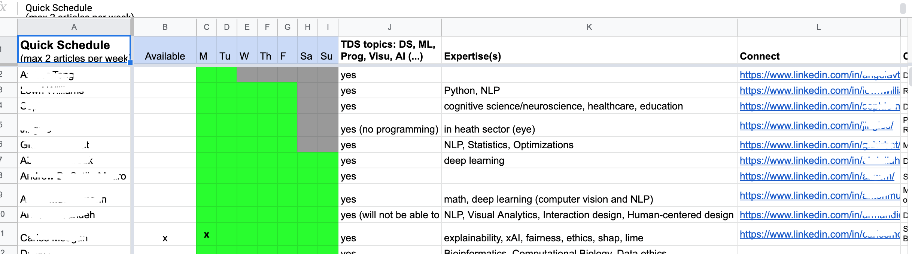
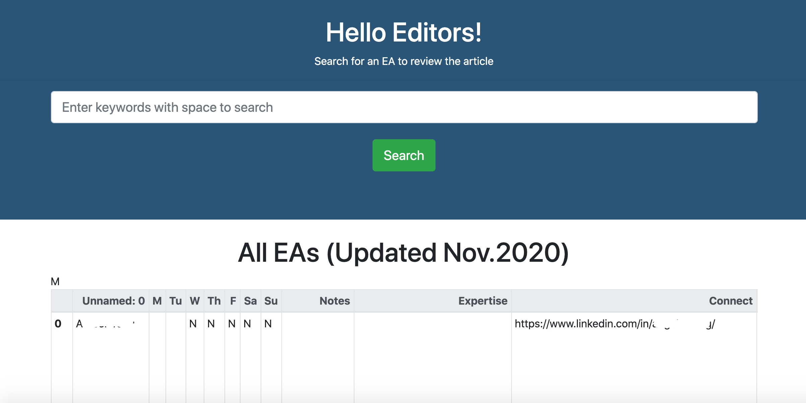
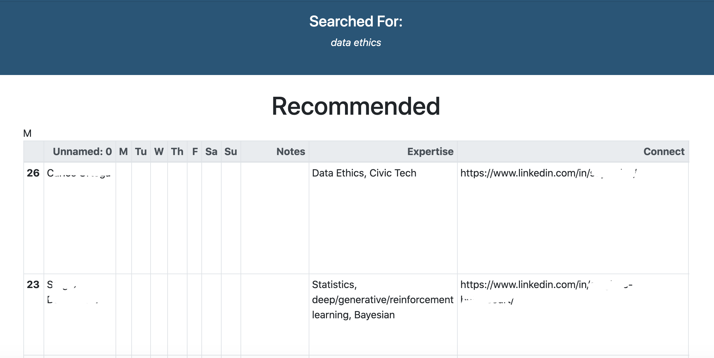

# TDS-recomsys

## Project Description:

This project aims to optimize the process for editors of tds to find the most suited editorial associates in the shortest period of time. Thus, a NLP recommendation engine was built. Editors type in the keywords of an article. The web app will rank all the editorial associates by their relevancy to the keywords that editors provided.

## File Structures

```
├── auth
│   └── auth.py
├── data
│   ├── EA_CSV.csv
│   └── process_data.py
├── models
│   ├── glove_model.pkl *** Stored with Git LFS
│   ├── glove_model.py
│   └── vectors.pkl
├── static
│   ├── css 
│   ├── fonts
│   ├── tds_icon.ico
│   ├── img
│   └── js
└── templates
│   ├── home.html
│   └── result.html
├── Procfile
├── README.md
├── app.py
├── nltk.txt
├── recomm_local.ipynb
├── requirements.txt
└── test.py
```

Files Highlight:

- ```data/``` contains the raw data in csv format and the code to clean code the data

- ```models/glove_model.pkl``` is the pre-trained word vectors by using [GloVe Twitter data](https://nlp.stanford.edu/projects/glove/). This file is stored in Git Large File. However, it is not necessary to download. For details, see Get Started Instructions below.

- ```models/glove_model.py``` has the code to produce the pre-trained word vectors and to turn wrods into vectos. 


- The web frontend is located in ```templates/```, which builds static assets deployed to the web server at ```static/```.


- ```recomm_local.ipynb```is the juypter notebook to make sure all the codes work.


- ```Procfile``` and ```nltk.txt``` are files for Heroku deployment


## Getting Started

### Installing Dependencies

#### Python 3.7 and Flask

Follow instructions to install the latest version of [Python](https://docs.python.org/3/using/) and [Flask](https://flask.palletsprojects.com/en/1.0.x/installation/#install-flask) for your platform.

#### Virtual Enviornment

We recommend working within a virtual environment whenever using Python for projects. This keeps your dependencies for each project separate and organaized. Instructions for setting up a virual enviornment for your platform can be found in the [python docs](https://packaging.python.org/guides/installing-using-pip-and-virtual-environments/)

Initialize and activate a virtualenv:

```
$ cd YOUR_PROJECT_DIRECTORY_PATH/
$ virtualenv --no-site-packages env
$ source env/bin/activate
```

#### PIP Dependencies
Once you have your virtual environment setup and running, install dependencies by

```pip install -r requirements.txt```

This will install all of the required packages we selected within the requirements.txt file.

### Start without downloading *.pkl files

1. Process Data

```
$ cd YOUR_PROJECT_DIRECTORY_PATH/data
$ python3 process_data.py EA_CSV.csv EAdescription.db
```

2. go to https://nlp.stanford.edu/projects/glove/ and download the ```glove.twitter.27B.zip```. Upzip the file and save it to YOUR_PROJECT_DIRECTORY_PATH/models

3. Train the model

```
$ cd YOUR_PROJECT_DIRECTORY_PATH/models
$ python3 glove_model.py ../data/EAdescription.db glove_model.pkl
```

This step might take about 10 mins

4. Run the development server

```
$ export FLASK_APP=myapp
$ export FLASK_ENV=development # enables debug mode
$ python3 app.py
```

5. Navigate to Home page http://0.0.0.0:8080/

### Start with *.pkl files downloaded

```
$ cd YOUR_PROJECT_DIRECTORY_PATH
$ export FLASK_APP=myapp
$ export FLASK_ENV=development
$ python3 app.py
```

Navigate to Home page http://0.0.0.0:8080/

## Results

Before, the editors need to go through an excel sheet like below to find the most suited EA



Now, they can go to a web page like below and type in the keywords with space.



For example, if we type in keywords "data ethics". The web page will render what we searched for and the first EA is the one that's most recommended.




## Author and Acknowledgement

Linda Chen is the author of this project.
